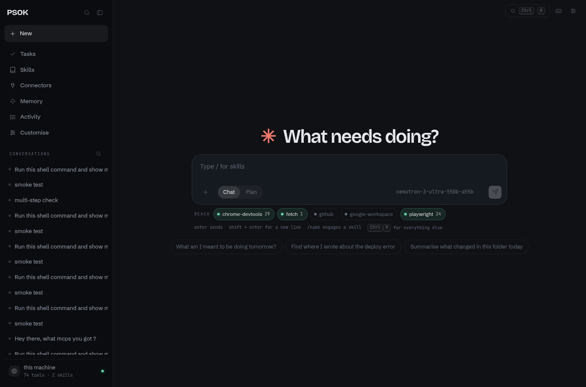
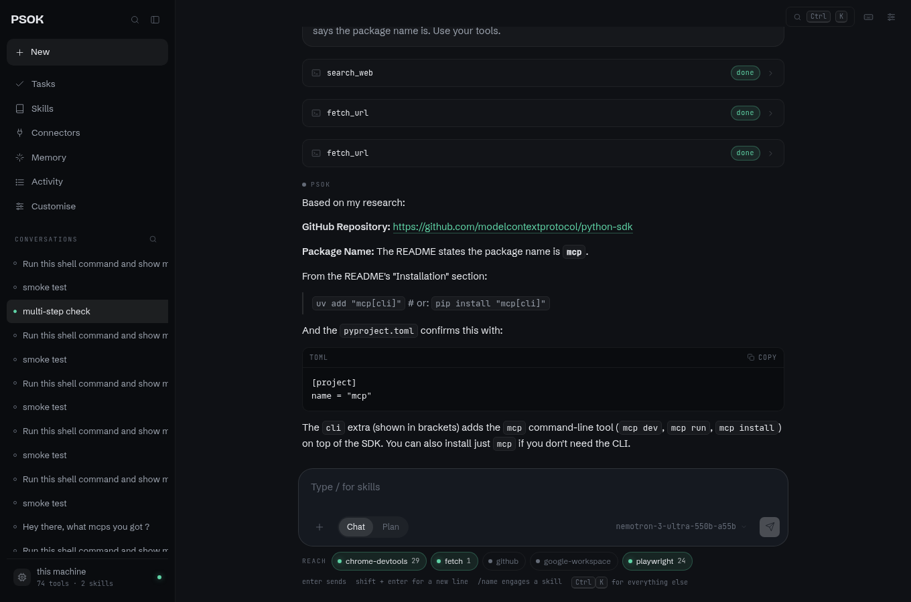
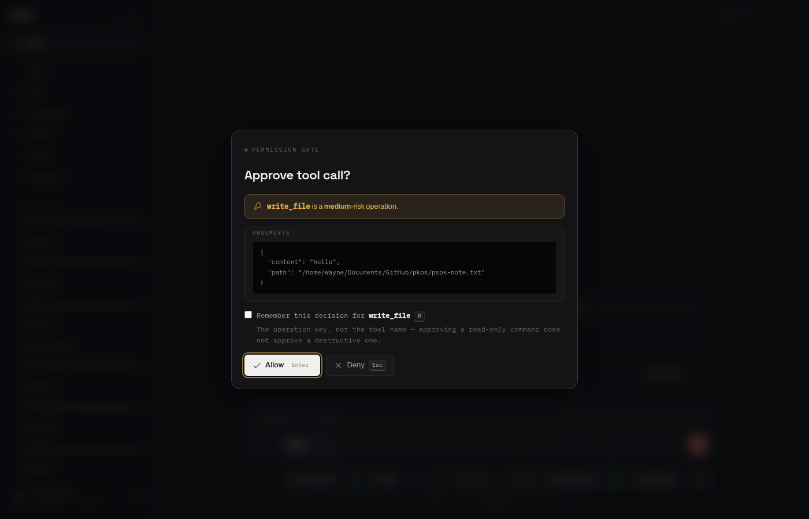
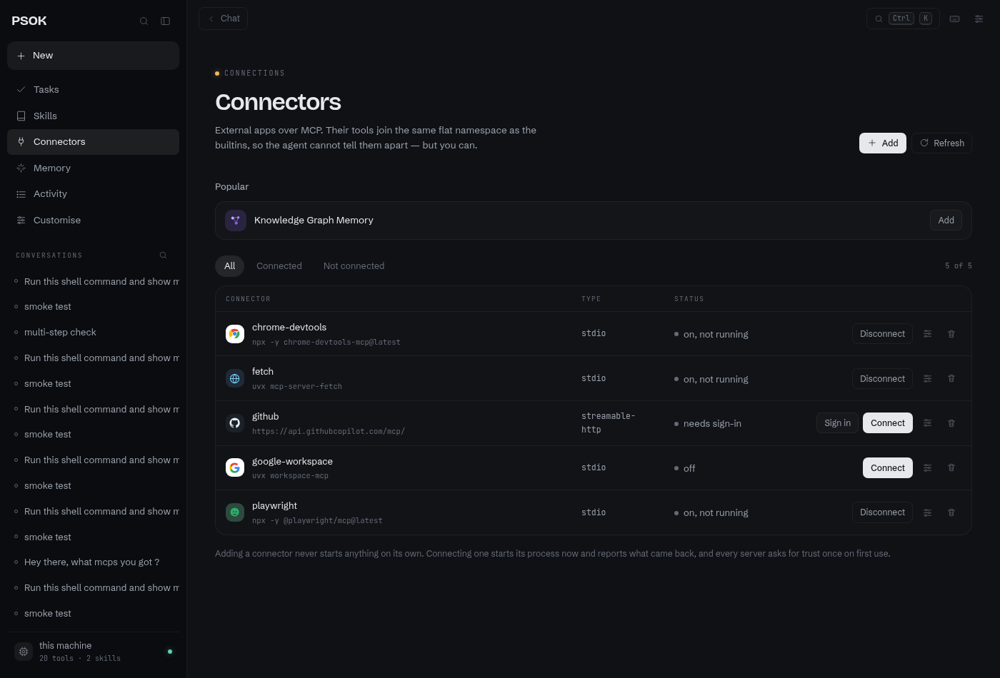
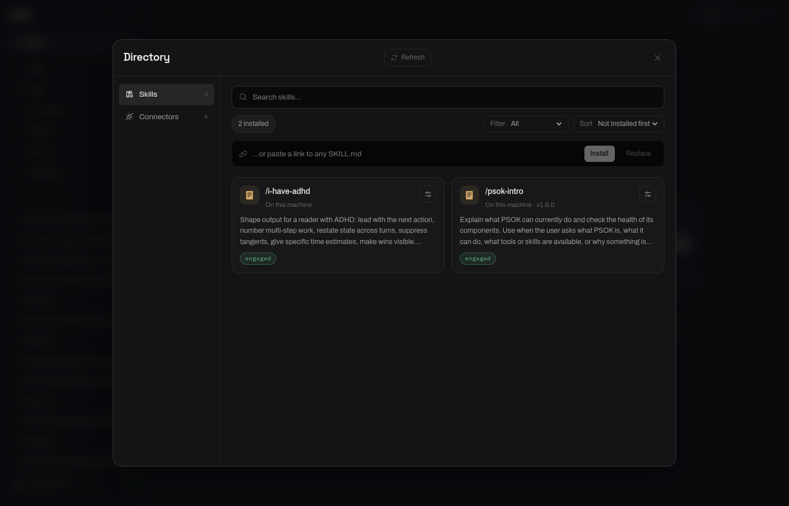
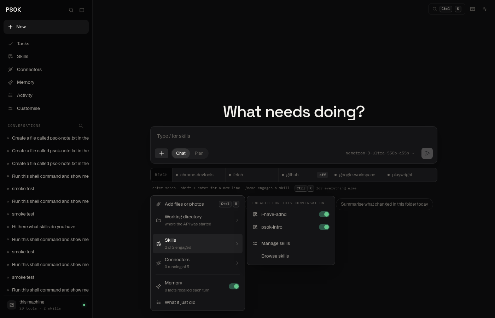

# PSOK

**A personal operating system: one AI agent over your files, shell, tasks, calendar, notes and connected services.** Single-user and local-first — your data stays in a SQLite file on your machine, your secrets stay in the OS keychain, and nothing is sent anywhere except to the model provider you choose.



---

## What it does

Ask for something in one line. PSOK decides which of its tools to use, asks permission before anything that writes or runs, and shows you exactly what it did.



That turn is three tool calls — a web search, then two fetches — resolved without being nudged. The agent loop treats an empty or truncated reply as unfinished work and continues rather than ending the turn on a blank bubble.

**Everything that writes or runs asks first**, and the prompt names the *operation*, not just the tool, so approving a read-only shell command never approves a destructive one.



---

## Quick start

```bash
uv venv
uv pip install -e '.[dev]'

psok init                              # ~/.psok, the database, default config
psok doctor                            # what is configured and what is missing

cd frontend && npm install && npm run build
psok serve --open                      # http://127.0.0.1:8000
```

`psok serve` is the whole product in one process: the API under `/api`, the built interface everywhere else. There is no second port and no cross-origin request to configure.

Point it at a model. Ollama is preconfigured; a cloud provider keeps its key in the OS keychain, never in the config file:

```bash
psok providers catalogue               # what PSOK knows how to configure
psok providers add anthropic
psok secrets set psok/anthropic        # prompts, so the key stays out of shell history
```

Or Settings → Models in the interface, which writes the same file.

Any OpenAI-compatible endpoint — vLLM, LM Studio, a proxy — works with no code change:

```yaml
providers:
  - name: my-vllm
    base_url: http://localhost:8000/v1
    default_model: llama-3.1-8b
    context_window: 32768              # optional; otherwise it is guessed
```

Configure a second provider and a turn survives the first one being down: it falls back, and says which provider answered. See [providers.md](docs/architecture/providers.md).

Prefer the terminal:

```bash
psok chat --provider anthropic --workspace ~/notes
psok logs                              # every tool call, with the decision that allowed it
```

---

## What works

Each of these was exercised end to end, not just wired up.

**The agent loop.** Reason → act → observe, with guards on iterations, wall-clock time, repeated calls and continuations. Streaming, retry on transient provider failures, and a stop that interrupts the loop on the server rather than just closing the browser's read.

**Multi-provider runtime.** One initialize-function contract per provider, a registry, and a fallback where any unrecognised provider name resolves to a generic OpenAI-compatible adapter driven by config. Provider quirks stay inside their adapter.

**20 builtin tools** across filesystem, shell, desktop, tasks, calendar, document search and the open web — plus every tool any connected MCP server exposes, in the same flat namespace. The model cannot tell them apart; you can.

**A permission gate with real sandboxing.** Every tool declares a static risk floor the model can raise but never lower. Shell commands run under Bubblewrap on Linux and Seatbelt on macOS. Paths under `~/.ssh`, `~/.aws` and similar always confirm, and no stored preference can silence them.

**MCP connectivity** with OAuth 2.1 + PKCE, a curated catalogue, SSRF protection on URL transports, per-server circuit breaking and a one-time trust confirmation per server.



**Hybrid retrieval** over a notes vault: semantic search fused with a real BM25 index (SQLite FTS5 + sqlite-vec), content-hash incremental indexing, so re-syncing an unchanged folder costs nothing.

**Long-term memory.** Standing facts extracted by a second model call after a turn and recalled in later conversations, updated by a create/supersede diff rather than an ever-growing transcript. Switchable off, globally or per conversation.

**Markdown skills**, installable from any URL and browsable in a directory that reads its sources live.



Everything the agent can be given for the next message hangs off one button beside the composer — files, the working directory, skills, connectors, and the full list of tools it can currently call.



**A web interface** over the same API: streamed answers rendered as markdown, inline permission prompts, a command palette, file attachments, connector setup — catalogue, OAuth, credentials — and a keyboard layer where `?` lists every binding.

**A CLI** that does all of it: `chat`, `serve`, `skills`, `mcp`, `memory`, `permissions`, `index`, `search`, `logs`, `capabilities`, `doctor`.

---

## Three ideas carry the design

**Above the dispatcher, everything is a tool.** A builtin function and a JSON-RPC call to an external MCP process are indistinguishable to the model. New capability does not touch the core.

**Permission is a floor the model can raise but never lower.** A model's self-assessment of an opaque operation can only escalate its risk, never reduce it — which is the failure mode of trusting self-reported risk alone.

**Interpretation is the model's job; computation is not.** The model extracts *"tomorrow"*; a deterministic engine resolves it against the clock, checks the calendar, and reports conflicts back rather than guessing.

---

## How it is put together

```
Interface (CLI · HTTP/SSE API · React app served by the same process)
        │
   Agent Loop ── the single owner of reason → act → observe
        ├── AI Runtime ......... provider adapters behind one contract
        ├── Tool Registry ...... one flat namespace; permission gate on every dispatch
        │     ├── builtin ...... filesystem, shell, desktop, tasks, calendar, web
        │     └── MCP .......... browser, GitHub, Google, or any server you add
        └── Retrieval .......... hybrid search over your notes
                │
        SQLite (+vec, +FTS5) · filesystem for documents · OS keychain for secrets
```

- [Architecture overview](docs/architecture/overview.md) — the layer model and a worked request
- [The web interface](docs/interface.md) — how the React app is built, and every keyboard binding
- [AI runtime](docs/architecture/ai-runtime.md) · [Providers](docs/architecture/providers.md) · [Data model](docs/architecture/data-model.md) · [Security](docs/architecture/security.md) · [MCP](docs/architecture/mcp.md) · [MCP OAuth](docs/architecture/mcp-oauth.md) · [Skills](docs/architecture/skills.md)
- [Decision records](docs/architecture/decisions/) — ADRs with the alternatives and what they cost
- [API contract](docs/NEXT-SESSION.md) — the 36 endpoints the interface is built against

---

## What was never built

Stated plainly, because half-built features are worse than absent ones and this repository deliberately contains none:

- **First-party service integrations.** Gmail, Calendar and GitHub are reachable as MCP connectors instead.
- **Recurring tasks and background jobs.** Scheduling resolves and stores; nothing wakes up on its own.
- **Deleting a conversation.** No endpoint — nothing in the architecture called for one.
- **Projects, artifacts, plugins, voice input.** No backing anywhere in the system.
- **Anything multi-user.** Out of scope by design ([ADR-0001](docs/architecture/decisions/)).

Provider adapters for Anthropic and OpenAI were only ever run against mocks — no key was available on the development machine — so their wire-format translation is unverified against the real APIs. NVIDIA NIM and the OpenAI-compatible path were exercised for real.

---

## Verifying it yourself

```bash
pytest                    # 259 unit tests
pytest -m live            # 5 more against real MCP servers (spawns processes, uses network)
ruff check psok tests

cd frontend
npm run lint && npm run build
npm run smoke             # 34 checks in a real browser against a running `psok serve`
```

The smoke suite is the one that matters: it drives Chromium against a live model and asserts what a person would see — a turn streaming, markdown rendering once and not twice, a shell call suspending the turn and the prompt answering to the keyboard, a skill installing from the directory and uninstalling again, the audit trail carrying the call.

Sandbox containment is tested against the real OS and skips where unavailable (Windows, or Linux without `bubblewrap`). The live MCP suite exists because a transport that only works against a mock is not evidence that MCP works.

---

**On the look of it.** The interface is deliberately an instrument panel rather than a product page: warm graphite instead of the blue-black every dark app defaults to, Space Grotesk and Archivo over IBM Plex Mono for anything the machine reports, Phosphor icons on a single grid, and colour reserved for exactly three meanings — running, waiting on you, destructive. Motion follows Emil Kowalski's rules: transform and opacity only, nothing over 220ms, and no animation at all on the things you hit a hundred times a day. The signal strip under the composer is the one place it spends any boldness, and it earns it by being true.

Built with Python 3.11+, FastAPI, SQLite, React and Vite. No licence file was ever added, so all rights are reserved by default; treat it as reference material rather than something to redistribute.
